# Sending Emails with Nodemailer and GMail

## Prerequisites
* Installed `node`, `npm` and `git`
* Created project folder and `npm init` and `git init` done
* Installed node modules with `npm install`: `express, nodemailer, dotenv`
* Created Google Cloud Platform account: [https://console.cloud.google.com/](https://console.cloud.google.com/)

<br>

## Configure secure GMail access
1. 'Open [https://console.cloud.google.com/home](https://console.cloud.google.com/home)
2. Press New Project
<br>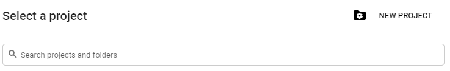
3. Insert project name - Location can be left empty - Click "Create" 
<br>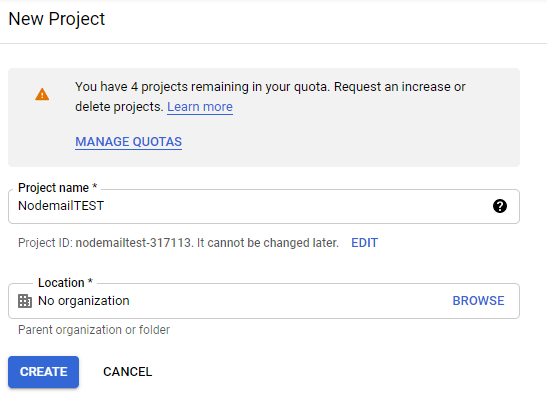
4. Now the project should be selected like that  
<br>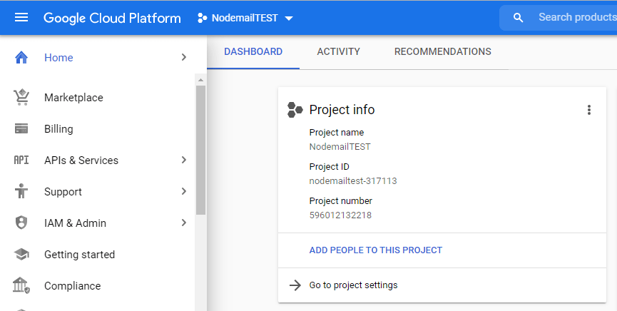
5. Select "APIs & Services" - "OAuth consent screen"
<br>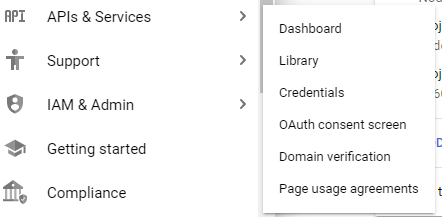
6. Select External and click "Create"
<br>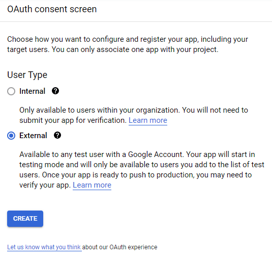  
7. Enter mandatory fields "App name" / "User support mail" / "Developer contact information" - click "Save And Continue"
<br> 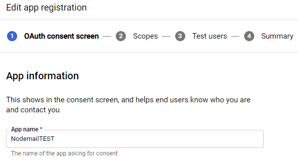
8. Skip the Scopes page with again clicking "Save and Continue"
9. Add Test User clicking on "+ Add Users"
<br>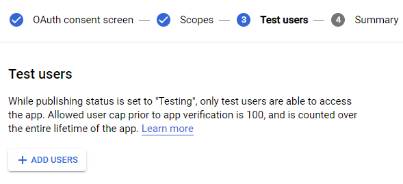
10. Select "Credentials" form the left menue  
<br>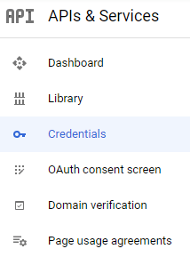
11. Create Credentials for OAuth client ID
<br>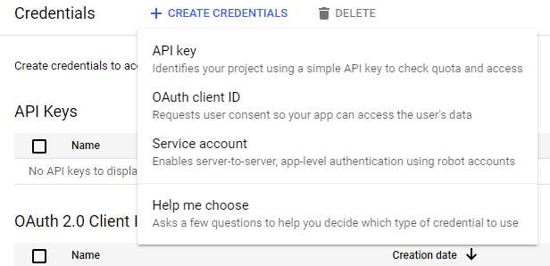
12. Select "Application type" - Web application
<br>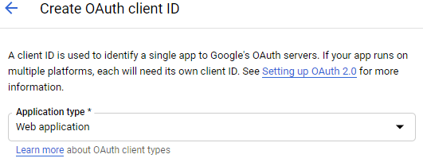
13. Add [https://developers.google.com/oauthplayground](https://developers.google.com/oauthplayground) at "Authorized redirect URIs" with clicking "+ Add URI" and then click "Create"
<br>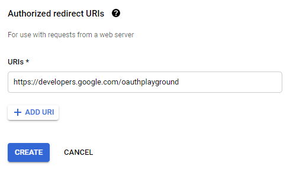
14. You now should see your Client-ID and Client-Secret - we need them later - press "OK"
<br>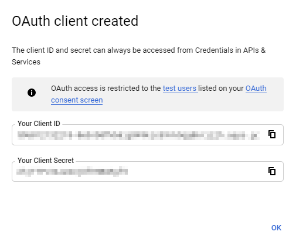
15. Open OAuth 2.0 Playground: [https://developers.google.com/oauthplayground/](https://developers.google.com/oauthplayground/)
16. Select on the left side "Gmail API v1" and there "https://mail.google.com" and click "Authorize APIs"
<br>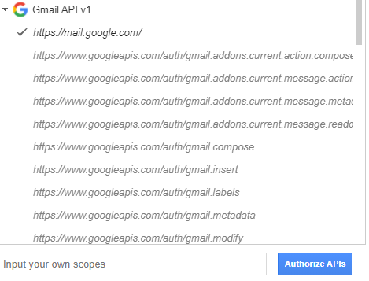
17. Select your GMail-Account you want to use  
<br>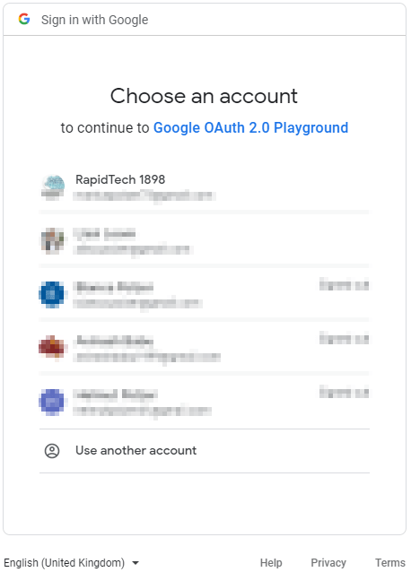
18. Allow permissions
<br>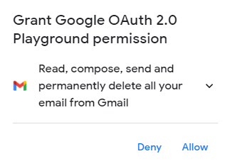
19. Allow again - to work with emails from GMail  
<br>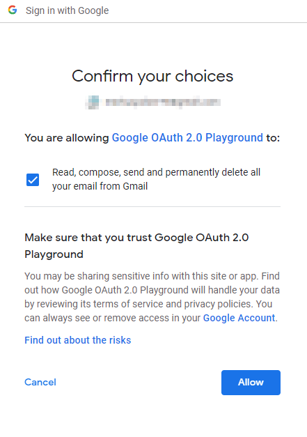
20. Click on "Exhange authorization code for tokens" to get Refresh Token and Access Token  
<br>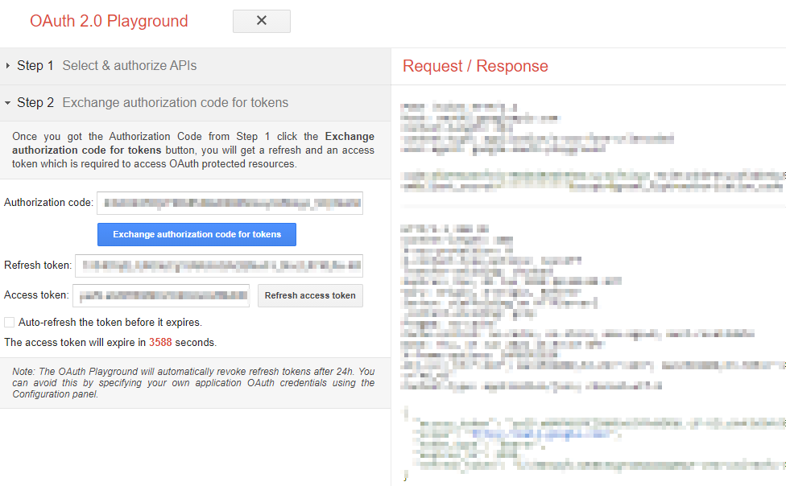

<br>

## Setup the environment-variables and .gitignore
(its important that you NEVER write such secure informations directly in a code which can be unindentionally uploaded to eg. GitHub - allways use instead dotenv and hidden-files like .env which should never get uploaded anywhere stays only locally)
* Create `.env` file
* Include informations from the GMail configuration (Client-ID and Client-Secret from step 14 and Refresh-Token from stemp 20)
```plaintext
OAUTH_CLIENTID=yourClientID
OAUTH_CLIENT_SECRET=yourClientSecret
OAUTH_REFRESH_TOKEN=yourRefreshToken
MAIL_USERNAME=yourGMailAdress
MAIL_PASSWORD=yourGMailPassword
```
* Create `.gitignore` file (if not exists) and add at least to it  
```plaintext
.env
node_modules
```

<br>

## Do the Coding
* Create new file `app.js`
* Require necessary modules  
```plaintext
const express = require('express')
const nodemailer = require('nodemailer');
require("dotenv").config({ path: "./.env" });
const { gmail } = require('googleapis/build/src/apis/gmail')
```
* Create running express server
```plaintext
const app = express()
const port = 3000
app.listen(port, () => {
  console.log(`nodemailerProject is listening at http://localhost:${port}`)
})
```
* Define the transporter from nodemail
(take all the sensitive information for the .env-variables)
```plaintext
let transporter = nodemailer.createTransport({
  service: 'gmail',
  auth: {
    type: 'OAuth2',
    user: process.env.MAIL_USERNAME,
    pass: process.env.MAIL_PASSWORD,
    clientId: process.env.OAUTH_CLIENTID,
    clientSecret: process.env.OAUTH_CLIENT_SECRET,
    refreshToken: process.env.OAUTH_REFRESH_TOKEN
  }
});
```
* Define mail options
```plaintext
let mailOptions = {
  from: process.env.MAIL_USERNAME,
  to: "towhomiwillsend@gmail.com",
  subject: 'Nodemailer Test Project',
  text: 'Hallo from my nodemailer project'
};
```
* Send mail with error handling and successfull-message
```plaintext
transporter.sendMail(mailOptions, function(err, data) {
  if (err) {
    console.log("Error " + err);
  } else {
### console.log("Email sent successfully");
  }
});
```  

<br>

## Find the full code here: [https://github.com/Rapid1898-code/exampleNodeMailerGMail](https://github.com/Rapid1898-code/exampleNodeMailerGMail)

### If you have any questions or suggestions please do not hesitate to get in contact with me: <a href="mailto:rapid1898@gmail.com"><span>mail</span></a>


